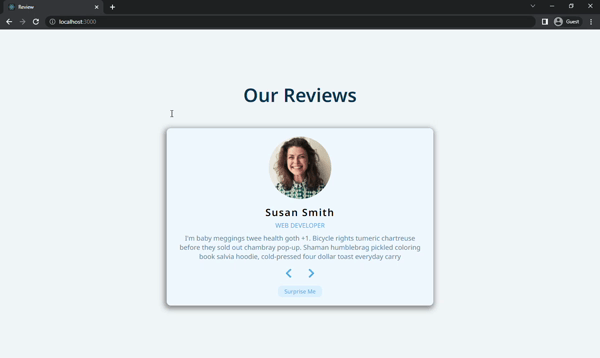

# Reviews
In this project, you can do passing between the people when clicking the buttons. If you click on the "Surprise Me" button, the people appear on the screen randomly. When clicking on the "Prev" or "Next" buttons, the people appear on the screen ordered.



## Used Technologies
* 

* 

* 

## Installation
First clone the project.
```
git clone https://github.com/saglamburcu/react-reviews.git
```

## Usage
After cloning the project, open it in Visual Studio Code.
```
cd react-reviews
code .
```
Download node modules to make it work
```
npm install
```
To make it work
```
npm start
```